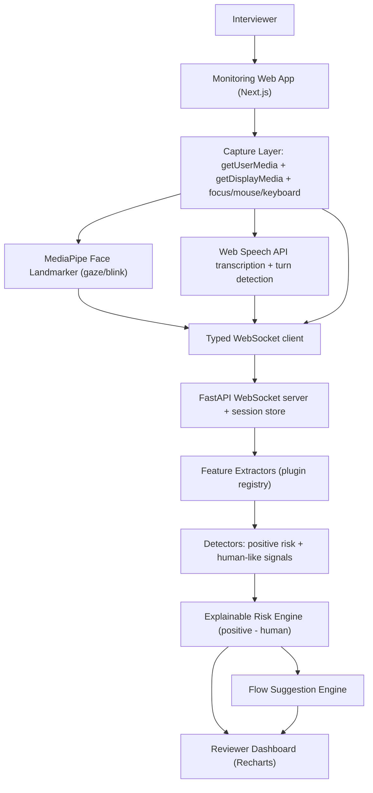

# AntiCopy - Passive Interview Integrity Monitor

> Catching the Invisible AI Cheater - an **AI-assisted reviewer, not an AI judge.**

AntiCopy is a passive, browser-only companion application that estimates the
**probability that an interview candidate is using a real-time AI interview
assistant** (Parakeet AI, FinalRound AI, Cluely, etc.).

It **never accuses**. It provides explainable behavioural evidence, a risk score,
a confidence score, and adaptive interviewer guidance. **The interviewer always
makes the final decision.**

- Zero install. No browser extension. No desktop agent. Browser permissions only.
- Runs alongside Google Meet (or any meeting) - it does not interact with the meeting at all.
- Every score is explainable, and **every suspicious signal can be offset by a
  human-like signal**, which is how false positives are minimised.

---

## Table of contents

- [How it works](#how-it-works)
- [Architecture](#architecture)
- [Tech stack](#tech-stack)
- [Repository layout](#repository-layout)
- [Quick start](#quick-start)
- [Running the demo](#running-the-demo)
- [The explainable risk engine](#the-explainable-risk-engine)
- [Feature modules](#feature-modules)
- [WebSocket protocol](#websocket-protocol)
- [Extending AntiCopy (plugin architecture)](#extending-anticopy-plugin-architecture)
- [Assumptions](#assumptions)
- [Limitations](#limitations)
- [Upgrade paths](#upgrade-paths)

---

## How it works

1. The interviewer opens the AntiCopy website.
2. Clicks **Start Monitoring**.
3. Grants **microphone** and **Google Meet tab / screen capture** permissions
   (with tab audio). Local webcam is not required for remote candidate gaze.
4. Starts or joins the interview in Google Meet (in a captured tab) and
   **pins/spotlights the candidate**.
5. AntiCopy passively analyses behaviour in the browser and streams typed
   features to the backend over a WebSocket.
6. A live reviewer dashboard shows risk, confidence, evidence, counter-evidence,
   timelines, transcript, ownership, and the suggested next question.

No interaction with Google Meet. Everything runs independently.

---

## Architecture



The pipeline has clean seams: **capture -> features -> detectors -> risk/flow ->
dashboard**. Feature extraction is fully decoupled from scoring, and detectors
are independent of one another.

---

## Tech stack

**Frontend:** Next.js 16, React 19, TypeScript, TailwindCSS v4, shadcn-style UI,
Recharts, MediaPipe Tasks Vision (Face Landmarker), MediaDevices /
`getDisplayMedia`, Web Speech API, WebSockets.

**Backend:** FastAPI, Python 3.12, Pydantic v2, spaCy (`en_core_web_sm`).

**Optional upgrade paths (off by default):** WhisperLive / whisper.cpp streaming
ASR, Silero VAD, scikit-learn / XGBoost model in the risk engine.

---

## Repository layout

```
AntiCopy/
├── backend/
│   ├── app/
│   │   ├── main.py            # FastAPI app + /ws/monitor/{id} WebSocket
│   │   ├── schemas.py         # Typed inbound/outbound protocol (Pydantic v2)
│   │   ├── session.py         # Per-session rolling buffers + turn derivation
│   │   ├── pipeline.py        # Orchestration: extract -> detect -> score -> package
│   │   ├── risk_engine.py     # Explainable risk = positive - human
│   │   ├── flow_engine.py     # Adaptive next-question suggestions
│   │   ├── whisperlive.py     # Optional streaming-ASR bridge (flagged off)
│   │   ├── extractors/        # Feature extractor plugins (timing, speech_rate, ...)
│   │   └── detectors/         # Positive + human-like signal detectors
│   ├── scripts/ws_smoke.py    # End-to-end WebSocket smoke test
│   └── requirements.txt
└── frontend/
    └── src/
        ├── app/               # Next.js routes: / (console) and /dashboard (reviewer)
        ├── components/        # UI primitives + dashboard sections
        ├── hooks/             # Capture, vision, speech, activity, socket, controller
        └── lib/               # Types, config, simulation, helpers
```

---

## Quick start

### Prerequisites
- Node.js 20+ and npm
- Python 3.12 (3.11+ works)
- A Chromium browser (Chrome/Edge) for live capture (Web Speech API + screen/tab
  audio). The **simulation** demo works in any modern browser.

### 1. Backend

```bash
cd backend
python -m venv .venv
# Windows PowerShell:
.\.venv\Scripts\Activate.ps1
# macOS/Linux:
# source .venv/bin/activate

pip install -r requirements.txt
python -m spacy download en_core_web_sm   # NLP model (recommended)

uvicorn app.main:app --host 127.0.0.1 --port 8000
```

Verify: open http://127.0.0.1:8000/health and http://127.0.0.1:8000/docs .

> spaCy is optional. If the model isn't installed, the linguistics extractor
> degrades gracefully to a built-in tokenizer, so the app still runs.

### 2. Frontend

```bash
cd frontend
npm install
npm run dev
```

Open http://localhost:3000 .

---

## Running the demo

Two ways to drive the dashboard:

### A. Instant, deterministic demo (recommended for judging)
On the console page click **Demo: AI-Assisted** or **Demo: Human**. This replays
a scripted interview through the *real backend engine* (no camera/mic needed) and
fills the dashboard in seconds.

- **AI-Assisted** produces a **HIGH** risk with stacked evidence (consistent
  latency, stable WPM, reading-like and downward gaze, generic ownership, ...).
- **Human** produces a **LOW** risk driven by counter-evidence (ownership
  stories, self-corrections, variable latency, clarifying questions, ...).

This showcases the core thesis: the same engine, opposite conclusions, fully
explained.

### B. Live monitoring
Click **Start Live Monitoring**, grant your **microphone**, then share the
**Google Meet tab** with **"Also share tab audio"** enabled. Both are required
for a live session (simulation demos work without them).

Candidate gaze is analysed from the **Meet tab video** (not your local webcam),
so this works for fully remote interviews. For best results:

- **Pin or spotlight the candidate** in Meet so their face is the largest tile -
  AntiCopy automatically selects the largest/most-centered face as the candidate.
- Keep tab audio shared so the candidate's speech can be transcribed.

AntiCopy watches for **downward and off-screen gaze** (e.g. reading notes or a
second screen) as *supporting* evidence, never as sole proof. Tag question types
as you ask them to unlock interview-dynamics comparisons.

If the Meet tab isn't shared (or sharing is stopped mid-session), the console
clearly shows that candidate gaze is blocked. Speech-based analysis still runs
as long as the mic and tab audio remain available.

### Reviewer dashboard on a second screen
Click **Open reviewer dashboard** (or visit `/dashboard?session=<id>`). It
connects read-only to the same session and mirrors all analytics live - useful
for a shadow reviewer.

---

## The explainable risk engine

AntiCopy deliberately does **not** sum suspicious features. Instead:

```
Final Risk = Positive-behaviour pressure  -  Human-behaviour pressure
```

- Each **detector** emits `Signal { direction, weight, confidence, explanation }`.
- `positive_pressure = Σ (weight × confidence)` over positive signals.
- `human_pressure    = Σ (weight × confidence)` over human-like signals.
- `risk_score = clamp((positive_pressure − human_pressure) / DENOM, 0..100)`.

Thresholds are conservative (`HIGH ≥ 65`, `MEDIUM ≥ 35`) to minimise false
positives, and **confidence** is reported separately based on how much data has
been collected and how many strong signals agree.

Example output (never an accusation):

```
Risk:        MEDIUM     Confidence: HIGH
Evidence:        ✓ Consistent response latency  ✓ Stable WPM  ✓ Reading-like gaze
Counter-Evidence:✓ Asked clarifying questions  ✓ Shared a debugging story
Summary: "...advisory only - the interviewer makes the final decision.
          The system never accuses; it explains."
```

---

## Feature modules

| # | Module | Where |
|---|--------|-------|
| 1 | Video analytics on the candidate Meet video (gaze, blink, off-screen %, downward gaze, reading scan, heatmap) | `frontend/.../useFaceLandmarker.ts`, `backend/app/extractors/gaze.py` |
| 2 | Live conversation analytics (latency, WPM, pauses, fillers, hedging, ownership) | `backend/app/extractors/{timing,speech_rate,linguistics,ownership}.py` |
| 3 | Interview dynamics (behaviour across question types) | `backend/app/extractors/base.py`, `frontend/.../InterviewDynamics.tsx` |
| 4 | Flow suggestion engine (next best question) | `backend/app/flow_engine.py` |
| 5 | Positive (risk-raising) signals | `backend/app/detectors/positive.py` |
| 6 | Negative (human-like) signals | `backend/app/detectors/human.py` |
| 7 | Explainable risk engine | `backend/app/risk_engine.py` |
| 8 | Reviewer dashboard | `frontend/src/components/dashboard/*` |

---

## WebSocket protocol

Endpoint: `ws://localhost:8000/ws/monitor/{session_id}`

**Inbound** (browser -> backend), discriminated on `type`:
`transcript`, `gaze`, `activity`, `question`, `control`. See
[`backend/app/schemas.py`](backend/app/schemas.py) and its TypeScript mirror
[`frontend/src/lib/types.ts`](frontend/src/lib/types.ts).

**Outbound** (backend -> browser): `ack`, `error`, and periodic `state`
(`MonitorState`) snapshots containing features, risk, flow, timelines, heatmap,
transcript and ownership.

Run the end-to-end smoke test against a running server:

```bash
cd backend
python -m scripts.ws_smoke
```

---

## Extending AntiCopy (plugin architecture)

**Add a feature extractor** - drop a file in `backend/app/extractors/` and
decorate it:

```python
from .base import register_extractor

@register_extractor
class MyExtractor:
    name = "my_feature"
    def extract(self, session):
        return {"my_metric": 1.23}
```

**Add a detector** - drop a file in `backend/app/detectors/`:

```python
from .base import register_detector
from ..schemas import Signal, SignalDirection

@register_detector
class MyDetector:
    name = "my_detector"
    def evaluate(self, features):
        return [Signal(id="x", label="...", direction=SignalDirection.human,
                       weight=0.5, confidence=0.8, explanation="...", detector=self.name)]
```

Both are auto-registered on import; the risk engine and dashboard pick them up
with no other changes.

---

## Assumptions

- The interviewer runs AntiCopy in a Chromium browser and shares the meeting tab
  (with tab audio) for candidate-side transcription.
- One candidate per session; the candidate is visible in the shared Google Meet
  tab (ideally pinned/spotlighted) so gaze is analysed from the Meet video, not
  the interviewer's local webcam.
- Timestamps from the browser are monotonic enough for latency/WPM math; the
  backend anchors all timelines to the first observed event.
- The interviewer optionally tags question types to enable interview-dynamics
  comparisons (the system still works untagged).

## Limitations

- **Not proof.** AntiCopy estimates *probability* from behaviour. It never claims
  100% detection and must never be used to accuse a candidate.
- **Web Speech API transcribes the active microphone.** Candidate-side
  transcription quality depends on meeting audio being audible to the browser.
  The WhisperLive backend path is the intended upgrade for robust dual-speaker
  transcription. Speaker attribution in the browser fallback uses a mic-vs-tab
  audio-energy heuristic.
- **Eye tracking is supporting evidence only** and is intentionally low-weighted;
  it is never the sole basis for a signal.
- Web Speech API is Chromium-only; other browsers should use the simulation demo
  or the WhisperLive upgrade.
- MediaPipe/WASM assets load from a CDN (no install); first load needs network.

## Upgrade paths

- **WhisperLive / whisper.cpp** streaming ASR: set `ENABLE_WHISPERLIVE=true` and
  implement the bridge in [`backend/app/whisperlive.py`](backend/app/whisperlive.py).
- **Silero VAD** for server-side speech/silence detection.
- **XGBoost / scikit-learn** learned risk model: set `ENABLE_ML_MODEL=true` and
  swap the additive engine in [`backend/app/risk_engine.py`](backend/app/risk_engine.py).

---

### Design principles (non-negotiable)

1. Never claim perfect AI detection. 2. Never accuse candidates. 3. Prioritise
minimising false positives. 4. Every suspicious feature has a human-like
counterpart that can reduce risk. 5. Explain every score. 6. The interviewer
always decides. 7. Build an AI-assisted reviewer, not an AI judge.
